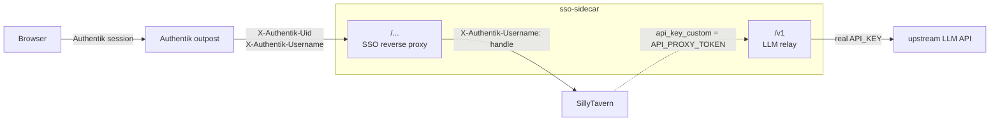

# SillyTavern SSO Sidecar

**Language:** [简体中文](README.md) | English

> Simplified Chinese is the source of truth for this document; the English
> version is a translation of it.

A fail-closed reverse proxy between an Authentik proxy outpost and
SillyTavern. It maps stable Authentik UIDs to SillyTavern handles, safely
provisions accounts, reconciles admin-group membership, and exposes a narrow
service-authenticated relay for an OpenAI-compatible LLM API.

  [](LICENSE) [](https://github.com/YatsukiRenka/sso-sidecar/actions/workflows/test.yml)

## Security model

The sidecar treats browser traffic and SillyTavern's server-side LLM traffic
as two separate trust paths:



The solid path is browser-initiated SSO traffic; the dotted edge is the relay
call that SillyTavern makes server-side.

- Normal SillyTavern requests are accepted only from an address in
  `TRUSTED_PROXY_CIDRS` and must contain both `X-Authentik-Uid` and
  `X-Authentik-Username`. Missing or untrusted identity data fails closed.
- Native password login/recovery, password changes, and SillyTavern's local
  user-administration endpoints are not forwarded. Authentik remains the
  identity and role source of truth. The SillyTavern backend must also stay on
  a private network.
- Provisioning logs in with a password-protected SillyTavern administrator.
  New SSO-only users receive a deterministic high-entropy password that is
  never returned to a browser.
- A signed binding cookie ties SillyTavern's long-lived browser session to the
  stable Authentik UID. A missing or mismatched binding discards the old
  backend cookie until SillyTavern issues a session cookie for the current SSO
  identity, preventing a browser user switch from reusing the previous user's
  SillyTavern session.
- UID mappings live in the sidecar's own atomically replaced state file.
  SillyTavern's `_storage`, `settings.json`, and `secrets.json` are never
  modified directly. Run exactly one sidecar replica for each `STATE_FILE`;
  the in-process lock does not coordinate concurrent replicas.
- `/v1` accepts only `GET /v1/models`, `POST /v1/chat/completions`, and
  `POST /v1/completions`. It requires a separate bearer relay token, validates
  and normalizes a strict JSON object and allowlisted model, rejects query
  parameters, strips client cookies and identity headers, and then injects the
  real upstream key. The models endpoint is generated locally from
  `ALLOWED_MODELS`, so it does not disclose the upstream catalog.
- SillyTavern emits relay requests server-side without the originating user's
  identity. Managed accounts therefore share `API_PROXY_TOKEN`: the sidecar
  cannot attribute relay use or revoke one user's access independently. Apply
  rate and spend limits at the upstream provider, and rotate the token if it
  may have been exposed.

Authentik documents that proxy groups are pipe-separated (`foo|bar|baz`),
which is the format this sidecar parses. See the
[Authentik proxy header reference](https://docs.goauthentik.io/add-secure-apps/providers/proxy/#headers-sent-to-upstream-applications).

## Required SillyTavern configuration

Configure multi-user mode, the network whitelist, and native Authentik SSO in
SillyTavern's `config.yaml`. These settings match the fixed sidecar address in
the Compose example below:

```yaml
whitelistMode: true
whitelist:
  - ::1
  - 127.0.0.1
  - 172.30.0.20 # allow the sidecar's connection to SillyTavern

# Recommended when Authentik serves users from addresses that are not all
# listed above. See the explanation below before changing this to true.
enableForwardedWhitelist: false

enableUserAccounts: true
allowKeysExposure: false

sso:
  autheliaAuth: false
  authentikAuth: true
  trustedProxies:
    - 172.30.0.20 # the sidecar address, not the Authentik outpost address
```

The sidecar address must appear in both `whitelist` and `sso.trustedProxies`,
but for different reasons: the first admits its network connection, while the
second permits it to supply normalized Authentik identity headers. The default
`whitelistDockerHosts: true` setting adds Docker host and gateway addresses,
not the address of a sibling sidecar container.

SillyTavern 1.18.0 defaults `enableForwardedWhitelist` to `true`. The sidecar
preserves forwarded client-IP headers, so that setting makes SillyTavern
require **both** the sidecar address and every forwarded client address to
match `whitelist`. Keep it enabled only when client-IP allowlisting is
intentional, and add every permitted client IP or narrowly scoped CIDR. For a
private SillyTavern backend that should accept all Authentik-authenticated
users through the sidecar, use `false` as shown above and keep the backend
network inaccessible by any other route.

Keep `sso.autheliaAuth` disabled. The sidecar supplies the normalized
`X-Authentik-Username` identity, while enabling Authelia would add a second
`Remote-User` identity path. The sidecar strips alternative identity headers
as defense in depth, but the unused authentication mode should still remain
off.

`allowKeysExposure: false` is also required. Managed users store the relay
credential as SillyTavern's `api_key_custom`; enabling key exposure can reveal
that shared credential through secret-view or user-backup features.

The browser-facing account-route allowlist was audited against SillyTavern
commit [`8172dcd0ee67`](https://github.com/SillyTavern/SillyTavern/commit/8172dcd0ee67).
Re-audit those routes before deploying a different release, fork, or staging
build.

The [SillyTavern SSO documentation](https://docs.sillytavern.app/administration/sso/)
explains the trusted-proxy requirement.

Also:

1. Set a strong password on the SillyTavern account named by `ADMIN_HANDLE`.
   Never leave that administrator passwordless.
2. Keep SillyTavern's port private. Only the sidecar should reach it.
3. Assign the Authentik outpost and sidecar stable private addresses (or stable
   narrowly scoped CIDRs). Configure the outpost address in
   `TRUSTED_PROXY_CIDRS`.

These controls intentionally apply at different hops:

| Setting | Allows |
|---|---|
| Sidecar `TRUSTED_PROXY_CIDRS` | Authentik outpost source address to present identity |
| SillyTavern `whitelist` | Sidecar source address to connect; also forwarded clients when `enableForwardedWhitelist: true` |
| SillyTavern `sso.trustedProxies` | Sidecar source address to present SSO identity |

## Configuration

### SSO and provisioning

| Variable | Default | Description |
|---|---|---|
| `ST_BACKEND` | `http://sillytavern:8000` | Private SillyTavern URL |
| `LISTEN_PORT` | `8001` | Sidecar listen port |
| `LOG_LEVEL` | `INFO` | Standard Python logging level name |
| `ADMIN_HANDLE` | `admin` | Password-protected SillyTavern provisioning administrator |
| `ADMIN_PASSWORD` / `_FILE` | required | Administrator password; minimum 20 characters |
| `USER_PASSWORD_SECRET` / `_FILE` | required | Stable key used to derive managed-user passwords; minimum 32 characters |
| `ADMIN_GROUPS` | `admins,staff` | Comma-separated Authentik groups that grant SillyTavern admin; empty means no SSO administrators |
| `AUTO_PROVISION` | `true` | Create a missing mapped account through the admin API |
| `ALLOW_USERNAME_LINKING` | `false` | Allow an unbound pre-existing handle to be claimed by a matching username |
| `TRUSTED_PROXY_CIDRS` | none | Required comma-separated Authentik outpost source CIDRs |
| `STATE_FILE` | `/var/lib/sso-sidecar/mappings.json` | Sidecar-owned atomic UID mapping file |
| `ST_DATA_DIR` | `/st-data/data` | Optional read-only legacy data root for importing old `ssoUid` mappings |
| `UID_CACHE_TTL` | `300` | Successful mapping/role cache lifetime in seconds |
| `SSO_MAX_BODY_BYTES` | `524288000` | Maximum decoded SillyTavern request size; bodies are streamed rather than buffered |
| `SSO_BINDING_COOKIE_SECURE` | `true` | Mark the UID-binding cookie Secure; disable only for local plain-HTTP testing |

`ALLOW_USERNAME_LINKING=false` prevents username reuse from taking over an
existing SillyTavern account. Old `ssoUid` records are imported read-only and
do not require this switch. For a deliberate one-time migration of unbound
accounts, enable the switch only while the intended users sign in, verify the
state file, and disable it again.

Admin roles are reconciled from `ADMIN_GROUPS` whenever an identity cache
entry is refreshed. A manual promotion of an SSO-bound account whose Authentik
groups do not match this setting will therefore be reverted; use the separate
`ADMIN_HANDLE` account for out-of-band administration.

### LLM relay

| Variable | Default | Description |
|---|---|---|
| `API_PROXY_ENABLED` | `true` | Enable the narrow `/v1` relay and default user configuration |
| `API_BASE_URL` | placeholder | Upstream OpenAI-compatible base URL, normally ending in `/v1` |
| `API_KEY` / `_FILE` | required | Real upstream API key; never written to user data |
| `API_PROXY_TOKEN` / `_FILE` | required | Independent random relay bearer token; minimum 32 characters |
| `ALLOWED_MODELS` | `deepseek-v4-flash` | Ordered comma-separated model allowlist |
| `DEFAULT_MODEL` | first allowed model | Must also appear in `ALLOWED_MODELS` |
| `ST_API_BASE` | `http://sso-sidecar:8001/v1` | Internal URL written into managed users' custom API settings |
| `API_MAX_BODY_BYTES` | `10485760` | Maximum relay JSON body size |

`ST_API_BASE` must be reachable from the SillyTavern container. Do not point it
at a public Authentik-protected browser URL: SillyTavern performs custom API
requests server-side. The sidecar writes `API_PROXY_TOKEN`, not the real API
key, into the managed user's `api_key_custom` secret through SillyTavern's own
authenticated secrets API.

Every secret supports a Docker/Kubernetes-style file variant. For example,
set `API_KEY_FILE=/run/secrets/api_key` instead of `API_KEY`. Setting both forms
for the same secret is rejected.

Generate independent random values, for example:

```sh
python -c "import secrets; print(secrets.token_urlsafe(48))"
```

Startup requires all four trust-domain secrets to be independent: it rejects
reuse among the upstream key, relay token, administrator password, and
managed-user derivation key.

## Compose example

This example assumes the Authentik outpost is `172.30.0.10`, the sidecar is
`172.30.0.20`, and both SillyTavern and the outpost join the same private
network. Do not publish the sidecar or SillyTavern ports directly.

```yaml
services:
  sso-sidecar:
    build: ./sso-sidecar
    restart: unless-stopped
    read_only: true
    cap_drop:
      - ALL
    security_opt:
      - no-new-privileges:true
    tmpfs:
      - /tmp
    environment:
      ST_BACKEND: http://sillytavern:8000
      ADMIN_HANDLE: admin
      ADMIN_PASSWORD_FILE: /run/secrets/st_admin_password
      USER_PASSWORD_SECRET_FILE: /run/secrets/user_password_secret
      ADMIN_GROUPS: admins,staff
      TRUSTED_PROXY_CIDRS: 172.30.0.10/32
      STATE_FILE: /var/lib/sso-sidecar/mappings.json
      ST_DATA_DIR: /st-data/data
      API_PROXY_ENABLED: "true"
      API_BASE_URL: https://your-llm-provider.example/v1
      API_KEY_FILE: /run/secrets/upstream_api_key
      API_PROXY_TOKEN_FILE: /run/secrets/api_proxy_token
      ALLOWED_MODELS: deepseek-v4-flash
      DEFAULT_MODEL: deepseek-v4-flash
      ST_API_BASE: http://sso-sidecar:8001/v1
    secrets:
      - st_admin_password
      - user_password_secret
      - upstream_api_key
      - api_proxy_token
    volumes:
      - sillytavern_data:/st-data/data:ro
      - sidecar_state:/var/lib/sso-sidecar
    networks:
      sso_internal:
        ipv4_address: 172.30.0.20

networks:
  sso_internal:
    external: true

volumes:
  sillytavern_data:
    external: true
  sidecar_state:

secrets:
  st_admin_password:
    file: ./secrets/st_admin_password
  user_password_secret:
    file: ./secrets/user_password_secret
  upstream_api_key:
    file: ./secrets/upstream_api_key
  api_proxy_token:
    file: ./secrets/api_proxy_token
```

### Linux host permissions

The runtime image removes `pip` after dependency installation and installs
`/app/app.py` as root-owned mode `0444`. Only the state directory is writable
by the runtime user.

The image runs as UID/GID `10001:10001`. The named `sidecar_state` volume in
the example is recommended because it does not overlay the image-owned state
directory with an arbitrary host directory. If you replace it with a bind
mount such as `./sidecar-state:/var/lib/sso-sidecar`, create the source for the
container user before startup:

```sh
sudo install -d -o 10001 -g 10001 -m 0700 ./sidecar-state
```

Any existing `mappings.json` must also be readable and writable by UID 10001.
The sidecar creates a temporary file in the same directory and atomically
replaces `mappings.json`, so making only the file writable is insufficient.

Docker Compose implements a top-level `secrets.<name>.file` source as a bind
mount. Every parent directory must therefore be searchable by the container
user, and each secret file must be readable by UID or GID 10001. One
least-privilege setup for the four files in this example is:

```sh
sudo chown root:10001 ./secrets ./secrets/*
sudo chmod 0750 ./secrets
sudo chmod 0440 ./secrets/*
```

Do not put `mode` under the top-level secret definitions: that field accepts a
source such as `file`, not mount permissions. Service-level long syntax has
`uid`, `gid`, and `mode` fields, but Docker Compose ignores them for a `file`
source because it uses a bind mount. Set the permissions on the host files
instead; the [Compose service-secrets reference](https://docs.docker.com/reference/compose-file/services/#secrets)
documents this limitation.

These commands assume a Linux Docker Engine without user-namespace remapping.
Rootless Docker, user namespaces, and Docker Desktop can translate ownership
differently; verify that the running container can read every configured
`*_FILE` and write the directory containing `STATE_FILE`.

Point the Authentik proxy provider's internal host at
`http://sso-sidecar:8001`. Make sure the network still permits the sidecar to
reach the configured LLM provider, or attach a separate egress network.

## Updating

These steps assume the source-build Compose example above, a checkout at
`./sso-sidecar`, and a service named `sso-sidecar`. Adapt the checkout path or
service name if your deployment differs.

### Before updating

1. Record the currently deployed revision so that it can be rebuilt if a
   rollback is needed:

   ```sh
   git -C ./sso-sidecar rev-parse HEAD
   ```

2. Back up the identity mapping while the existing container is still
   available:

   ```sh
   install -d -m 0700 ./backup
   docker compose cp \
     sso-sidecar:/var/lib/sso-sidecar/mappings.json \
     ./backup/mappings.json.pre-upgrade
   ```

   Skip the copy if no mapping file exists yet. Keep the backup private: it
   contains stable identity mappings, although it does not contain account
   passwords.

3. Keep the existing `sidecar_state` volume and all configured secrets. In
   particular, changing `USER_PASSWORD_SECRET` prevents the sidecar from
   verifying existing managed accounts. Do not run `docker compose down
   --volumes` as part of an update.

4. Compare the deployment with [Required SillyTavern configuration](#required-sillytavern-configuration)
   and the current environment-variable tables. When upgrading from a release
   before v0.3.0, ensure that `allowKeysExposure: false` and
   `sso.autheliaAuth: false` are present. Invalid integer, boolean, log-level,
   URL, or secret-file settings now fail cleanly at startup instead of being
   accepted implicitly.

### Rebuild and replace the sidecar

Run these commands from the directory containing the Compose file:

```sh
git -C ./sso-sidecar switch main
git -C ./sso-sidecar pull --ff-only origin main
docker compose config --quiet
docker compose build --pull sso-sidecar
docker compose up --detach --no-deps --wait sso-sidecar
docker compose logs --tail=100 sso-sidecar
```

If the required SillyTavern settings changed, restart or recreate SillyTavern
using that deployment's normal procedure before testing SSO. A plain
`docker compose restart` does not apply changed image or environment
configuration, which is why the commands above use `up`.

Confirm that the service is healthy, then test an ordinary SSO login, an
administrator-group login if applicable, and the configured LLM relay. v0.3.0
does not change the mapping-state format, so no manual state migration is
required.

### Rollback

Check out the revision recorded before the update, rebuild the same service,
and recreate only the sidecar:

```sh
git -C ./sso-sidecar switch --detach <previous-revision>
docker compose build sso-sidecar
docker compose up --detach --no-deps --wait sso-sidecar
docker compose logs --tail=100 sso-sidecar
```

Do not delete the state volume. This update does not require restoring the
mapping backup; retain it as a recovery copy. If a future release explicitly
changes the state format, follow that release's migration notes and restore a
matching backup only while the sidecar is stopped, preserving UID/GID
`10001:10001`. Run `git -C ./sso-sidecar switch main` when ready to retry the
upgrade.

## Mapping and failure behavior

- A UID already in the state file always maps to the same handle, even if the
  Authentik username changes or the new username cannot form an ASCII handle.
- One UID cannot be rebound to another handle, and one handle cannot be bound
  to multiple UIDs.
- A provisioning or storage failure returns `503` and is retried on a later
  request. The original Authentik username is never passed through as a
  fallback.
- Removing a user from every configured admin group demotes the mapped account
  on the next uncached role check; adding a group promotes it.
- Managed accounts are credential-verified on every uncached reconciliation;
  a deleted/re-created account or changed password fails closed before role
  synchronization. Pending accounts can also resume after an interrupted
  creation/config sequence. Keep `USER_PASSWORD_SECRET` stable so that
  verification remains possible.
- Managed-user API configuration is fingerprinted. Rotating
  `API_PROXY_TOKEN`, changing `DEFAULT_MODEL`, or changing `ST_API_BASE`
  reapplies the settings and relay secret on that user's next uncached login.
- Run one sidecar replica per `STATE_FILE`. Horizontal replicas require
  separate state files or an external transactional state store.

## Development

Install the development dependencies and run the regression suite:

```sh
python -m pip install -r requirements-dev.txt
ruff check app.py tests
ruff format --check app.py tests
python -m unittest discover -s tests -v
python -m py_compile app.py
```

The test suite covers relay authentication and route restrictions, encoded
path traversal, bounded chunked bodies, alternative-identity header stripping,
strict JSON and model validation, bounded streaming and compressed SSO bodies,
trusted proxy enforcement, raw cookie preservation, redirect rewriting,
fail-closed account routes, per-UID provisioning concurrency, clean startup
errors, credential-verified retries, immutable UID bindings, state migration,
legacy-record robustness, and Authentik group parsing.

## License

[AGPL-3.0](LICENSE), Copyright (C) 2026 YatsukiRenka.

This project is a reverse proxy that users reach over a network, so it uses
AGPL-3.0 rather than GPL-3.0: anyone who modifies it and offers it to users as
a network service must make the corresponding source available to those users,
even if they never distribute a binary. SillyTavern itself is also AGPL-3.0.
